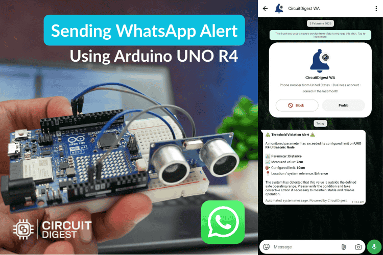
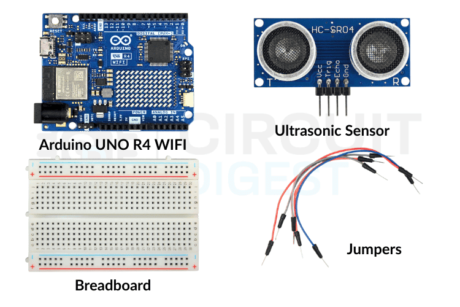
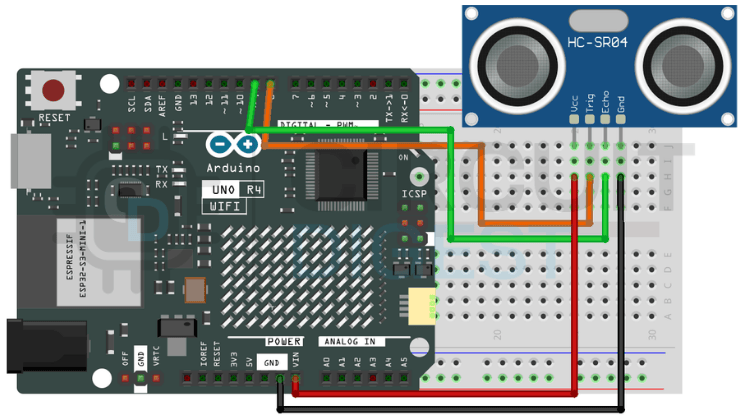

# Sending WhatsApp Alerts Using Arduino UNO R4 WiFi

This project demonstrates how to send WhatsApp notifications using an Arduino UNO R4 WiFi board with CircuitDigest Cloud's WhatsApp API. The system uses an ultrasonic sensor to detect proximity and automatically sends alert messages when an object comes within a specified distance threshold.

<div align="center">
  
</div>

## Table of Contents

- [Introduction](#introduction)
- [Components Required](#components-required)
- [Circuit Diagram](#circuit-diagram)
- [Setting Up CircuitDigest Cloud](#setting-up-circuitdigest-cloud)
- [Understanding the API](#understanding-the-api)
- [JSON Payload Structure](#json-payload-structure)
- [Source Code Explanation](#source-code-explanation)
- [Programming the Arduino](#programming-the-arduino)
- [Testing and Results](#testing-and-results)
- [Source Code](#source-code)

## Introduction

Sending WhatsApp messages from microcontrollers opens powerful possibilities for IoT applications. Whether you want to receive sensor alerts, monitor system status, or control devices remotely, WhatsApp provides a familiar and reliable notification channel. This tutorial shows how to integrate the Arduino UNO R4 WiFi with CircuitDigest Cloud's WhatsApp Notification API to create an intelligent distance monitoring system.

The Arduino continuously measures distance using an HC-SR04 ultrasonic sensor. When an object approaches closer than a predefined threshold, the board sends a WhatsApp message containing the device name, measured distance, and event description. A built-in cooldown mechanism prevents message flooding by limiting notifications to a configurable time interval.

## Components Required

<div align="center">
  
</div>

- **Arduino UNO R4 WiFi** - Microcontroller board with built-in WiFi capability
- **HC-SR04 Ultrasonic Sensor** - Distance measurement sensor
- **Jumper Wires** - For connections
- **USB Cable** - For programming and power
- **CircuitDigest Cloud Account** - For WhatsApp API access

## Circuit Diagram

<div align="center">
  
</div>

### Connections

| HC-SR04 Pin | Arduino Pin |
|-------------|-------------|
| VCC         | 5V          |
| GND         | GND         |
| TRIG        | D9          |
| ECHO        | D10         |

<div align="center">
  
</div>

## Setting Up CircuitDigest Cloud

Before you can send WhatsApp messages from your Arduino, you need to configure your CircuitDigest Cloud account and obtain an API key.

### Step 1: Create an Account and Login

Visit the CircuitDigest Cloud platform and create a new account if you don't already have one. After email verification, log in to access the dashboard.

<div align="center">
  
</div>

### Step 2: Link Your WhatsApp Number

Navigate to the WhatsApp API section from the main menu. Click the option to link your phone number and follow the on-screen instructions to connect your WhatsApp account.

<div align="center">
  
</div>

The platform will guide you through a verification process to authorize message sending. Once complete, your number appears as verified.

<div align="center">
  
</div>

### Step 3: Generate an API Key

Access the API Keys section from the dashboard menu.

<div align="center">
  
</div>

Click "Create New Key" or similar button to generate a unique API key. Copy this key immediately and store it securely, as you'll need it in your Arduino sketch.

<div align="center">
  
</div>

### Step 4: Review Usage Limits

Check the API usage limits and pricing details to understand the free tier allocation and any applicable charges for exceeding the quota.

<div align="center">
  
</div>

## Understanding the API

The CircuitDigest WhatsApp API provides a straightforward integration method for IoT devices. Instead of managing WhatsApp's complex Business API infrastructure directly, you send HTTPS POST requests with JSON payloads to CircuitDigest's endpoint. The platform handles authentication, message formatting, and delivery.

### API Endpoint

```
POST https://cloud.circuitdigest.com/api/notify/whatsapp
```

### Authentication

Include your API key in the JSON payload under the `api_key` field. The server validates this key before processing your request.

### Message Templates

CircuitDigest Cloud offers multiple pre-configured message templates for different notification scenarios. Each template includes placeholder variables that you populate with your device data. Common templates include:

- **critical_event_alert** - For urgent events requiring immediate attention
- **threshold_violation_alert** - When sensor readings exceed safety limits
- **operational_status_update** - For routine status reports

You select the desired template using the `template_id` field in your API request.

## JSON Payload Structure

The API uses a JSON structure to transmit message content. Think of the JSON payload as a form with fixed field names but dynamic content. The CircuitDigest Cloud platform reads your submitted data, identifies which template you selected, and automatically inserts your variable values into the corresponding placeholders before delivering the message.

### Standard JSON Structure

The following code block shows the basic structure. Do not modify the field names, as the API requires them.

```json
{
  "phone_number": "919876543210",
  "template_id": "critical_event_alert",
  "api_key": "YOUR_API_KEY",
  "variables": {
    "device_name": "Proximity Monitor",
    "var1": "Object detected",
    "var2": "15.2 cm",
    "var3": "Main entrance",
    "var4": "Immediate action required"
  }
}
```

### Field Descriptions

- **phone_number** - The recipient WhatsApp number, including country code (e.g., 919876543210 for India)
- **template_id** - Specifies which message template to use from the available options
- **api_key** - Your authentication key from CircuitDigest Cloud
- **variables** - Contains the dynamic values that populate the template placeholders
  - **device_name** / **var1** / **var2** / **var3** / **var4** - Sensor readings or descriptive text from your application

You can rename the variable fields to match your template requirements. For example, use `parameter`, `measured_value`, or `location` for clarity. The platform automatically maps them to the template's placeholder positions in order.

### Processing Flow

When your Arduino transmits this JSON payload through an HTTPS POST request, CircuitDigest Cloud receives it and performs the following operations:

1. Validates your API key to confirm authentication
2. Retrieves the template specified by `template_id`
3. Replaces each `{#var#}` placeholder with the corresponding value from your `variables` object
4. Sends the formatted WhatsApp message to the registered recipient

You never construct the message text manually in your firmware. The template system handles all formatting automatically, ensuring consistent and professional notifications.

### Example Payload Formats

The following examples demonstrate different payload configurations for various use cases. These are reference examples only. Replace all values with your actual sensor data and device information.

#### Proximity Detection Alert

**Template:** `critical_event_alert`  
Used when an object enters the detection zone, and immediate notification is required.

```json
{
  "phone_number": "919876543210",
  "template_id": "critical_event_alert",
  "api_key": "YOUR_API_KEY",
  "variables": {
    "device_name": "Entry Sensor",
    "var1": "Motion detected",
    "var2": "8.5 cm",
    "var3": "Front door",
    "var4": "Security alert"
  }
}
```

#### Distance Threshold Violation

**Template:** `threshold_violation_alert`  
Used when the measured distance crosses a predefined safety limit.

```json
{
  "phone_number": "919876543210",
  "template_id": "threshold_violation_alert",
  "api_key": "YOUR_API_KEY",
  "variables": {
    "device_name": "Safety Monitor",
    "var1": "Threshold exceeded",
    "var2": "12.3 cm",
    "var3": "Production line",
    "var4": "Warning level"
  }
}
```

#### System Status Update

**Template:** `operational_status_update`  
Used for routine status reports or non-urgent notifications.

```json
{
  "phone_number": "919876543210",
  "template_id": "operational_status_update",
  "api_key": "YOUR_API_KEY",
  "variables": {
    "device_name": "Distance Sensor",
    "var1": "Normal operation",
    "var2": "45.0 cm",
    "var3": "Parking area",
    "var4": "All systems OK"
  }
}
```

Remember that these examples show format only. Customize the values to reflect your actual application requirements and sensor readings. The system will accept any text content you provide, so make your messages clear and informative.

## Source Code Explanation

Before examining the complete source code, let's understand the program's operational logic. The Arduino continuously measures distance using the ultrasonic sensor, compares the reading against a configured threshold, and triggers a WhatsApp alert when an object comes too close. A cooldown timer prevents message flooding by enforcing a minimum interval between consecutive alerts.

### Include Libraries

The sketch begins by including the necessary libraries for WiFi connectivity and HTTPS communication:

```cpp
#include <WiFiS3.h>
#include <WiFiSSLClient.h>
```

`WiFiS3.h` provides network connectivity functions specific to the Arduino UNO R4 WiFi, while `WiFiSSLClient.h` enables secure HTTPS communication with the cloud server.

### Pin Definitions

Next, the code defines the GPIO pins connected to the ultrasonic sensor:

```cpp
const int trigPin = 9;
const int echoPin = 10;
```

### Configuration Constants

The distance threshold and cooldown period are defined as constants for easy modification:

```cpp
const float DISTANCE_THRESHOLD = 20.0;  // cm
const unsigned long COOLDOWN_PERIOD = 20000;  // 20 seconds
```

The program sets alerts to trigger when the distance falls below 20 centimeters, with a 20-second cooldown between messages. Adjust these values based on your specific application needs.

### WiFi and API Configuration

WiFi credentials and API configuration follow:

```cpp
const char* ssid = "YOUR_WIFI";
const char* password = "YOUR_PASS";
const char* api_key = "YOUR_API_KEY";
```

Replace these placeholder strings with your actual network name, password, and the API key obtained from CircuitDigest Cloud.

### WiFi Client Setup

A secure WiFi client object handles encrypted communication:

```cpp
WiFiSSLClient client;
```

### Timestamp Tracking

The program maintains a timestamp to track the last alert:

```cpp
unsigned long lastAlertTime = 0;
```

### Setup Function

The `setup()` function executes once at startup. It initializes serial communication for debugging, configures the ultrasonic sensor pins, and establishes WiFi connectivity:

```cpp
void setup() {
  Serial.begin(115200);
  pinMode(trigPin, OUTPUT);
  pinMode(echoPin, INPUT);
  
  WiFi.begin(ssid, password);
  while (WiFi.status() != WL_CONNECTED) {
    delay(1000);
    Serial.println("Connecting to WiFi...");
  }
  Serial.println("Connected to WiFi");
}
```

The program waits in a loop until the WiFi connection succeeds before proceeding to the main monitoring loop.

### Distance Measurement

Inside the `loop()` function, the Arduino repeatedly measures distance by triggering an ultrasonic pulse and timing the echo return:

```cpp
digitalWrite(trigPin, LOW);
delayMicroseconds(2);
digitalWrite(trigPin, HIGH);
delayMicroseconds(10);
digitalWrite(trigPin, LOW);

long duration = pulseIn(echoPin, HIGH);
float distance = duration * 0.034 / 2;
```

The `pulseIn()` function measures how long the echo pin remains high. This duration gets converted to distance in centimeters using the speed of sound (0.034 cm/microsecond) divided by two for the round trip.

### Alert Logic

The program then checks if the measured distance violates the threshold and whether enough time has elapsed since the last alert:

```cpp
if (distance < DISTANCE_THRESHOLD && 
    (millis() - lastAlertTime > COOLDOWN_PERIOD)) {
  sendWhatsApp(distance);
}
```

When both conditions are satisfied, the code calls the `sendWhatsApp()` function with the measured distance value.

### Sending WhatsApp Messages

The `sendWhatsApp()` function handles all API communication. It first establishes a secure connection to the CircuitDigest Cloud server:

```cpp
if (client.connect("cloud.circuitdigest.com", 443)) {
  // Prepare and send request
}
```

Next, it constructs the JSON payload with the template ID and variable values:

```cpp
String jsonData = "{\"phone_number\":\"919876543210\",";
jsonData += "\"template_id\":\"critical_event_alert\",";
jsonData += "\"api_key\":\"" + String(api_key) + "\",";
jsonData += "\"variables\":{";
jsonData += "\"device_name\":\"Arduino Distance Monitor\",";
jsonData += "\"var1\":\"Object detected at " + String(distance) + " cm\",";
jsonData += "\"var2\":\"Distance threshold violated\",";
jsonData += "\"var3\":\"Laboratory\",";
jsonData += "\"var4\":\"Immediate attention required\"";
jsonData += "}}";
```

Notice how the measured distance value gets inserted dynamically using String concatenation. The rest of the payload contains static configuration.

The function then sends the HTTP headers followed by the JSON body:

```cpp
client.println("POST /api/notify/whatsapp HTTP/1.1");
client.println("Host: cloud.circuitdigest.com");
client.println("Content-Type: application/json");
client.print("Content-Length: ");
client.println(jsonData.length());
client.println();
client.println(jsonData);
```

After transmission, the code waits for the server response and displays it via serial for debugging purposes:

```cpp
while (client.available()) {
  String line = client.readStringUntil('\r');
  Serial.print(line);
}
```

Finally, the program updates the timestamp to reset the cooldown timer:

```cpp
lastAlertTime = millis();
```

This comprehensive workflow ensures reliable distance monitoring with controlled notification frequency. The architecture remains simple, maintainable, and easily adaptable to other sensor types or alert conditions.

## Programming the Arduino

Follow these steps to install the required software tools, configure the sketch, and upload the firmware to your Arduino UNO R4 WiFi board.

### Install Arduino IDE and Board Support

Download and install the latest Arduino IDE from the official website if you haven't already. Open the IDE, navigate to **Tools → Board → Boards Manager**, search for "Arduino UNO R4", and install the board package. This adds support for the R4 WiFi variant.

### Configure Network and API Settings

Open the sketch file and locate the configuration section near the top. Replace `YOUR_WIFI` with your network name, `YOUR_PASS` with the WiFi password, and `YOUR_API_KEY` with the key you generated from CircuitDigest Cloud. Update the phone number in the payload to match your verified recipient number with the country code.

### Select Board and Port

Connect your Arduino UNO R4 WiFi to your computer using the USB-C cable. From the Tools menu, select **Board → Arduino UNO R4 WiFi**. Then choose the correct port where your board appears. The IDE should automatically detect it.

### Upload and Verify

Click the Upload button to compile and flash the firmware. Wait for the upload to complete successfully. Open Serial Monitor (**Tools → Serial Monitor**) and set the baud rate to **115200**. You should see the WiFi connection status and distance readings. Place an object within the threshold distance to trigger a test alert.

## Testing and Results

After successfully uploading the firmware and powering the Arduino, the Arduino WhatsApp alert system initializes WiFi connectivity and begins continuous distance monitoring. The Serial Monitor displays real-time measurements and connection status. When an object approaches closer than the configured threshold, the Arduino immediately formats the API request and transmits it to CircuitDigest Cloud.

The demonstration shows the sensor detecting an approaching object and the corresponding Arduino sending a notification to the smartphone. The message includes the device name, event description, measured distance, and location information as configured in the payload. After sending an alert, the system respects the cooldown period before allowing another notification, preventing excessive messages during sustained proximity events.

You can monitor the serial output to verify distance readings and confirm when alerts are triggered. Successful API requests will show response codes from the server. Any connection failures or authentication errors also appear in the serial log, helping you troubleshoot configuration issues quickly.

## Source Code

The complete Arduino sketch is available in the [Source Code](Source%20Code/) folder. Download the `.ino` file and open it in your Arduino IDE to get started.

---

## License

This project is licensed under the MIT License - see the LICENSE file for details.

## Support

For questions or support, please visit [CircuitDigest Cloud](https://www.circuitdigest.cloud) or contact the CircuitDigest team.

---
